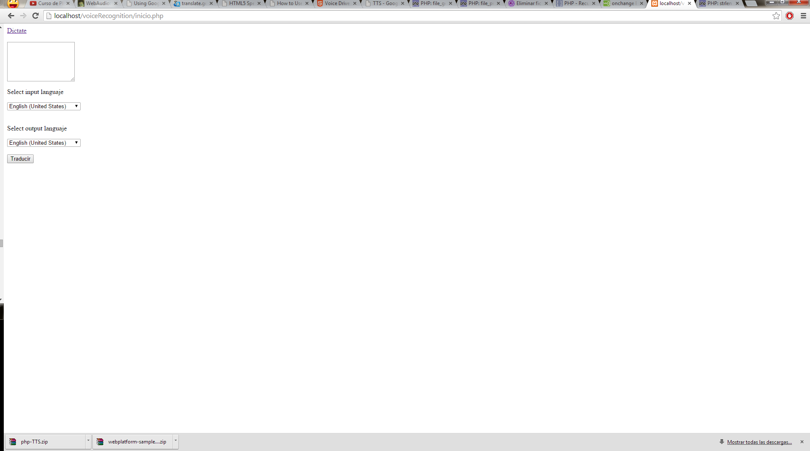
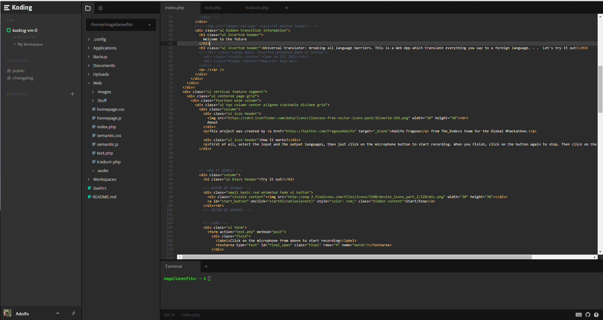
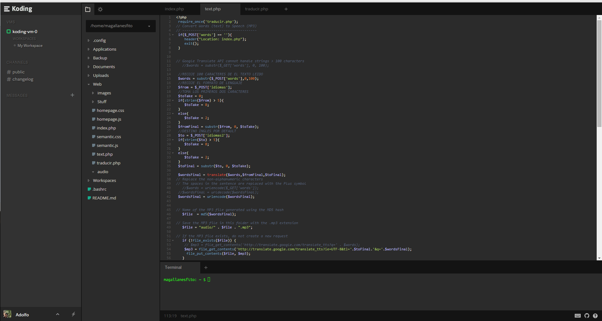
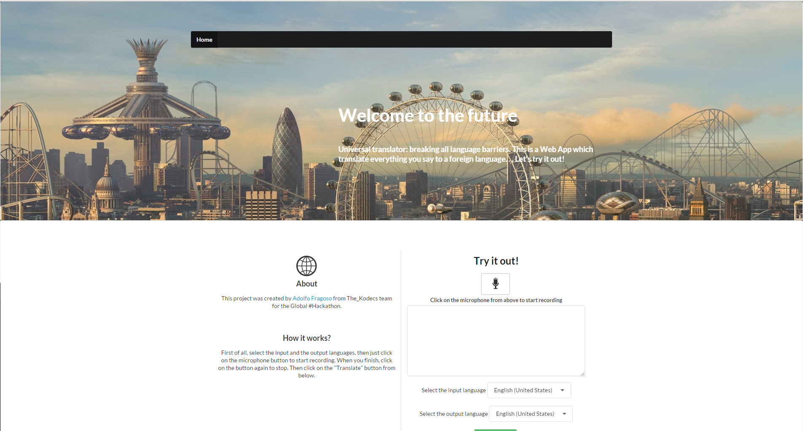

#Universal Translator from The_Kodecs team! 
==============================

<h3>Description</h3>

The idea of my project was based on the "Star trek Universal translator" wich is a device that you tell something in your "Native" language and tells the same thing but in another language you were specified, this allows you to talk with other species (Aliens included).In this case, I don't know any alien, so my project is only based on the audio translation of other languages in the world.

<h3>How it works?</h3>

First of all, you need a microphone which you are going to use to tell something. After that, choose the language in which you said. Then select the language you want to hear the translation and push the button to start recording, when you finish click the "Translate" button to Translate (ironic :) ) everything. 

<h3>Screenshots</h3>
  
  
  
  

<h3>Programming languages</h3>
<ul>
  <li>PHP</li>
  <li>Javascript</li>
  <li>HTML5</li>
  <li>CSS</li>
  <li>Semantic UI</li>
  <li>Jquery</li>
  <li>Google Speech API</li>
</ul>

<h3>Recognition</h3>
<ul><li><a href="https://twitter.com/FragosoAdolfo" target="_blank">Adolfo Fragoso</a> From team The_Kodecs</li></ul>
